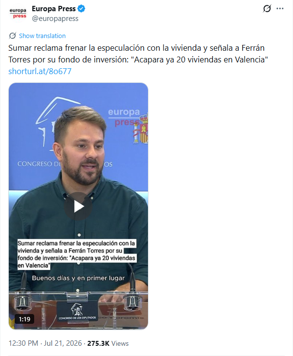

# España 1 - Sumar -1

Aunque parezca imposible, se puede perder un partido con un resultado negativo. Se puede si uno es alguien sin oficio ni beneficio y para medrar en la vida se apunta a Sumar.

Un tal Alberto Ibáñez no ha tenido mejor idea que tildar a Ferrán Torres de especulador inmobiliario.

Europa Press en X: [https://x.com/europapress/status/2079514254432948556 :octicons-link-external-16:](https://x.com/europapress/status/2079514254432948556){:target=_blank}

<!-- more -->


Los méritos de Alberto Ibáñez para criticar lo que otra persona hace con su dinero están detallados en su perfil del [Congreso de los Diputados :octicons-link-external-16:](https://www.congreso.es/es/busqueda-de-diputados?p_p_id=diputadomodule&p_p_lifecycle=0&p_p_state=normal&p_p_mode=view&_diputadomodule_mostrarFicha=true&codParlamentario=165&idLegislatura=XV&mostrarAgenda=false){:target=_blank}

```
Estudios en Ciencias Políticas por la Universidad de Valencia.
Estudios en Educación Social por la Universitat Oberta de Catalunya.
Teniente Alcalde y Concejal de Cultura en Vila-Real (2011-2015).
Viceconsejero de Igualdad e Inclusión en la Generalitat 2015 2020, Portavoz de Compromís e Iniciativa, 2022-actualidad.
```


Es posible traducirlo al román-paladino-castizo para que lo entienda cualquier mortal. Primero se apuntó a Ciencias Políticas y no hizo ni los exámenes de primer año. A continuación, se apuntó a la universidad a distancia online y completar el registro en Educación Social ya fue demasiado.

El resto de su vida la ha dedicado a medrar en el partido y vivir del dinero de los demás. Porque producir, lo que se dice producir, no ha sido el caso. De invertir el dinero producido puede uno, por tanto, olvidarse.

Y *Sumar* lo que se dice *Sumar*, este caballero lo único que suma son deméritos.
