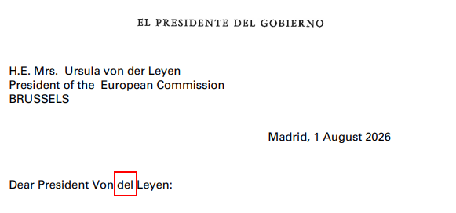
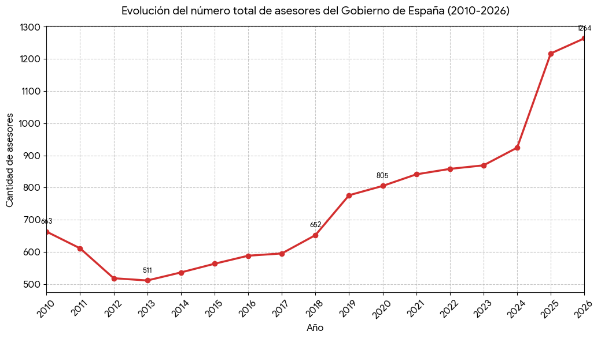

# 609 Asesores, 0 Correctores y La Carta de China

Ni en los partidos de alevines se ven estos resultados. Pero es simplemente la realidad: P.S. tiene 609 asesores en Presidencia. Pero 0 (patatero) de ellos son correctores. Lo sabemos porque, desde que dejó de dar el tostón con los ladrillos de Irene Lozano, su negra literaria, se pasó al género epistolar. Y es un no parar.

Que si carta a la ciudadanía por *Bego Pillafondos* (*"soy un hombre profundamente enamorado"*), que si carta a Periquín y a Perico el de los Palotes y a Paco el de los Botes. Tan suelto se ha visto que ha decidido enviar la última a la UE, puede que con *Xi Jinping* de negro (literario). Sí, ese *Xi Jinping*, el de la China en el Zapat(er)o.

[El Diario - La carta de Pedro Sánchez a los líderes europeos tras las amenazas de suspender Schengen por Ceuta :octicons-link-external-16:][link-01]{:target=_blank}

[link-01]: https://www.eldiario.es/politica/documento-carta-pedro-sanchez-lideres-europeos-amenazas-suspender-schengen-ceuta_1_13422430.html

<!-- more -->

Curiosamente, el PDF no se encuentra buscando en ese artículo, sino en este otro: [El Diario - Sánchez acusa a varios gobiernos europeos de atacar a España y pide una reunión de urgencia de ministros de Interior :octicons-link-external-16:][ps-ataque-ue]{:target=_blank}

[ps-ataque-ue]: https://www.eldiario.es/internacional/sanchez-acusa-gobiernos-europeos-atacar-espana-pide-reunion-urgencia-ministros-interior_1_13422370.html

El PDF: [El Diario - Carta :octicons-link-external-16:][carta-pdf]{:target=_blank}

[carta-pdf]: https://static.eldiario.es/eldiario/public/content/file/original/2026/0801/08/2026-01-08-carta-presidenta-comision-europea.pdf

Es fácil darse cuenta de que la carta ha sido escrita por los servicios de inteligencia chinos de *Xiji*.

Dejando atrás el pésimo humor y la nada fina ironía, es fácil preguntarse a qué se dedican los asesores de P.S. Claro está que ninguno de ellos ejerce el rol de corrector. Ni tan siquiera cuando uno eleva una misiva a las más altas esferas de la UE.

Se dedican a la máquina del fango. Es muy sencillo darse cuenta porque la segunda página de la carta a Ursula menciona las *"fake news"*. Y nunca fue más verdad que en el caso de P.S. aquello de *"cree el ladrón que todos son de su condición"*.

Aquí está la evolución de los asesores presidenciales durante los últimos 17 años.

| Año | Presidente del Gobierno | Total de Asesores (Todo el Ejecutivo) | Contexto de la Legislatura |
| :--- | :--- | :---: | :--- |
| **2010** | José Luis Rodríguez Zapatero | **663** | Última etapa de Zapatero (crisis financiera) |
| **2011** | J. L. Rodríguez Zapatero / M. Rajoy | **611** | Cambio de Gobierno en diciembre |
| **2012** | Mariano Rajoy | **518** | Ajustes presupuestarios de la Administración |
| **2013** | Mariano Rajoy | **511** | Periodo de contención de gasto público |
| **2014** | Mariano Rajoy | **536** | Estabilización del personal eventual |
| **2015** | Mariano Rajoy | **563** | Final de la X Legislatura |
| **2016** | Mariano Rajoy | **588** | Gobierno en funciones y posterior investidura |
| **2017** | Mariano Rajoy | **595** | Último año completo de mandato de Rajoy |
| **2018** | M. Rajoy / Pedro Sánchez | **652** | Moción de censura en junio |
| **2019** | Pedro Sánchez | **776** | Elecciones generales y repetición electoral |
| **2020** | Pedro Sánchez | **805** | Primer Gobierno de coalición (PSOE - Podemos) |
| **2021** | Pedro Sánchez | **841** | Ampliación de estructuras a 22 ministerios |
| **2022** | Pedro Sánchez | **858** | Consolidación de altos cargos |
| **2023** | Pedro Sánchez | **869** | Elecciones generales y nuevo Ejecutivo |
| **2024** | Pedro Sánchez | **924** | Gobierno de coalición (PSOE - Sumar) |
| **2025** | Pedro Sánchez | **1.217** | Inclusión de entes y agencias estatales |
| **2026** | Pedro Sánchez | **1.264** | Cifra máxima registrada en la serie |

En formato gráfico.

Cierto es que no todos asesoran directamente a P.S. Adscritos a Presidencia del Gobierno solo hay 609. [The Objective - Sánchez bate su récord de asesores y personal de confianza en Moncloa y ya alcanza los 609 :octicons-link-external-16:][theobj-asesores]{:target=_blank}

[theobj-asesores]: https://theobjective.com/espana/2026-04-18/sanchez-record-asesores-609-moncloa-coste-eventuales/

Lo cual quiere decir que P.S. tiene más asesores para él solito de los que, por ejemplo, tenía M. Rajoy en total.

Y de los 609, o 1.264, ni tan siquiera uno ha tenido a bien echarle un vistazo a la carta que han enviado a *"Von del"*. Tan amiga ella de P.S., de *"el guapo"*.

La moraleja en realidad nos habla de la mentira, al mismo tiempo que de la verdad, del socialismo y los méritos. Un socialista debería estar preocupado por el gasto de los recursos públicos. Ante lo cual disminuiría el número de asesores. Un gran mérito.

Ese es, por supuesto, el socialismo de mentira, el teórico. El real se centra en acaparar recursos para la élite y que los demás se apañen como puedan con los restos. El gran demérito, por supuesto.
