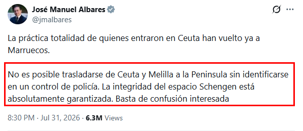

# De Ceuta a Schengen ... Pero ni Uno ...

En la vida aplica muy, pero que muy generalmente, el *"Reden ist Silber, Schweigen ist Gold"* o, dicho en castizo, *"Hablar es plata, callar es oro"*.

Cuando uno ve lo que era de esperar para cualquier ser humano con dos dedos de frente, es cuando más aplica.

En *"The Objective"*: [Decenas de marroquíes llegan al Campo de Gibraltar en lanchas y motos acuáticas :octicons-link-external-16:][link-01]{:target=_blank}

[link-01]: https://theobjective.com/espana/politica/2026-08-02/feijoo-critica-situacion-calles-ceuta-mientras-mafias-fletan-lanchas-peninsula/

<!-- more -->

Sería importante que el más alto representante del Reino de España ante el mundo, el Ministro de Exteriores, hubiera permanecido callado. O que, de haberse visto forzado a hablar, hubiera sido diplomático, y no tan solo un diplomático de medio pelo.

[X - Albares garantizando Schengen :octicons-link-external-16:][x-alb-schengen]{:target=_blank}

[x-alb-schengen]: https://x.com/jmalbares/status/2083258896106332256

Era obvio que iban a llegar. Los ilegales no suelen ser los que deciden pasar por el control donde la Policía está esperando para autorizar la entrada en la península. Los ilegales, Sr. Albares, son los que van por las otras vías.

Qué fácil habría sido decir algo como: *"España va a reforzar los controles policiales para evitar traslados ilegales de Ceuta a la Península"*. Pero, claro, los adalides del sanchismo están dotados de un halo divino que les confiere el poder de la verdad absoluta.

¡Tremendo!
