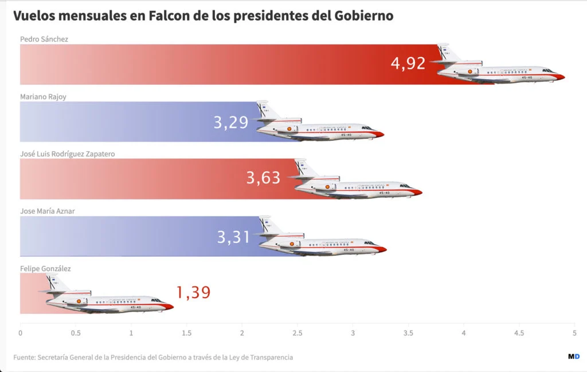

# P.S. no es un autócrata ... ¡Ja!

En su libro  [Amazon.es - *"Tierra Firme"* :octicons-link-external-16:][amazon-es-ps-tierra-firme]{:target=_blank} nos dice P.S., escrito en realidad por su negra literaria (Irene Lozano), que él **no** es un autócrata a pesar de lo que digan algunos.

La realidad, siempre tozuda, nos cuenta otra cosa.

[amazon-es-ps-tierra-firme]: https://www.amazon.es/Tierra-firme-PENINSULA-edici%C3%B3n-espa%C3%B1ol/dp/8411002233/

[Okdiario - Sánchez sale a escondidas de Lanzarote en Falcon rumbo a La Moncloa sin pisar Ceuta
en 22 días de vacaciones :octicons-link-external-16:][link-01]{:target=_blank}

[link-01]: https://okdiario.com/espana/sanchez-sale-escondidas-lanzarote-falcon-rumbo-moncloa-sin-pisar-ceuta-22-dias-vacaciones-20159526

<!-- more -->

No, el problema no es que utilice el Falcon. *Mr. Falconetti* ya ha adormecido tanto a la población que poco importa que el *ecojoleta* mayor del reino utilice una vez más el Falcon para un desplazamiento privado. Porque él argumenta que son vacaciones privadas, ergo ...

Tampoco importa (o sí) que sea el presidente que más utiliza el dichoso Falcon y que no tenga a mal auto-invitarse a un Falcon o dos, o los que haga falta, para ir a conciertos y similares. Para muestra dos botones.

  - [maldita.es - ¿Qué presidente ha usado más el Falcon? Pedro Sánchez con una media de cinco viajes mensuales: le siguen Zapatero, Rajoy, Aznar y Gónzalez :octicons-link-external-16:][maldita-presis-falcon]{:target=_blank}

  - [Okdiario - Éste es el momento en que Sánchez y Begoña se suben al Falcon para irse al Primavera Sound :octicons-link-external-16:][okdiario-ps-primav-sound]{:target=_blank}

[maldita-presis-falcon]: https://maldita.es/malditodato/20191207/que-presidente-usa-mas-el-falcon/

[okdiario-ps-primav-sound]: https://okdiario.com/espana/okdiario-caza-pedro-sanchez-begona-gomez-subiendo-falcon-irse-primavera-sound-17933291

Lo que choca del viaje de Lanzarote a Madrid es la nocturnidad. Tanto en la salida **como** en la llegada. Del artículo de portada

!!! note
    *"Pedro Sánchez ha puesto fin este domingo a sus semanas de vacaciones en La Mareta escabulléndose por una entrada privada de la base aérea militar de Lanzarote, una vía de acceso que, según ha podido saber OKDIARIO, no está abierta de forma habitual y que tuvo que ser habilitada expresamente para que el presidente pudiera embarcar en el Falcon rumbo a Madrid sin pasar por el aeropuerto César Manrique «como cualquier mortal»"*

Casi nada para el **no**-autócrata. Uso privado del Falcon para vacaciones, conciertos y hace que le habiliten entradas especiales para él y su *Bego Pillafondos*, consumiendo recursos públicos. Es el clásico ejemplo de socialismo, el *"sociolisto"*.

Como ya se sabe, había más agentes en La Mareta que en Ceuta al inicio de la crisis. Por no hablar de la zona de exclusión marítima >1km. El **no**-autócrata es además muy cercano a las Fuerzas y Cuerpos de Seguridad del Estado a los que obliga a cuidar su intimidad no autocrática.

  - [Okdiario - Los guardias civiles que custodian La Mareta tienen que ir a una urbanización a un kilómetro para hacer sus necesidades :octicons-link-external-16:][okdiario-gc-baño-1km]{:target=_blank}

[okdiario-gc-baño-1km]: https://okdiario.com/espana/guardias-civiles-que-custodian-mareta-tienen-que-ir-urbanizacion-kilometro-hacer-sus-necesidades-20158299

Nada hombre, que todo son méritos socialistas y para nada signos de autocracia.
