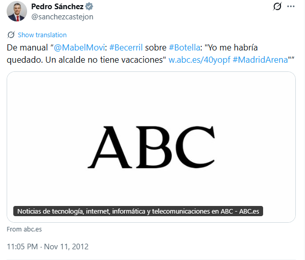

# P.S., ¡Qué mala es la hemeroteca!

No hay nada como la hemeroteca personal de P.S. para ver cómo se miente de manera profesional.

Perdón, cómo se cambia de opinión un día sí y todos los demás también.

[X - De manual “@MabelMovi: #Becerril sobre #Botella: "Yo me habría quedado. Un alcalde no tiene vacaciones" :octicons-link-external-16:][link-01]{:target=_blank}

[link-01]: https://x.com/sanchezcastejon/status/267749824437301248?sort_replies=recency

<!-- more -->

En 2012 se sumaba a la crítica de Soledad Becerril a Ana Botella por tomarse vacaciones durante la crisis del Madrid Arena.

Si él aceptaría que un cargo de su partido le dijera *"Yo como presidente, me quedaría"*, está por ver.

Hoy día dice: *«He estado con mi familia y he podido disfrutar un rato de ellos y un tiempo de ellos, y yo creo que eso es un derecho que evidentemente también tenemos los políticos»*. Visto en [El Debate - «De manual»: Sánchez discutió las vacaciones de la mujer de Aznar cuando aspiraba a liderar el PSOE :octicons-link-external-16:][eldebate-ps-critica-botella]{:target=_blank}

[eldebate-ps-critica-botella]: https://www.eldebate.com/espana/20260831/manual-sanchez-discutio-vacaciones-mujer-aznar-cuando-aspiraba-liderar-psoe_453962.html

Con una crisis de miles de personas en sus manos, con invasión, violación de la integridad territorial, violencia, violaciones, robos, ataques a patrullas del ejército, cancelación de las playas, gran parte de la población encerrada en casa y, muy probablemente, sin que el curso escolar pueda comenzar con normalidad.

Cómo cambian los deméritos de 2012 a 2026. Será porque no han pasado 20 años como los que dice P.S. que el Rey lleva reinando (lleva desde 2014). Visto en [The Objective - Sánchez señala a Felipe VI: «El Rey lleva 20 años reinando, ¿cuántas veces ha ido a Ceuta?» :octicons-link-external-16:][theobj-ps-rey-20-anos]{:target=_blank}

[theobj-ps-rey-20-anos]: https://theobjective.com/espana/politica/2026-08-31/sanchez-felipe-vi-rey-20-anos-ceuta/
